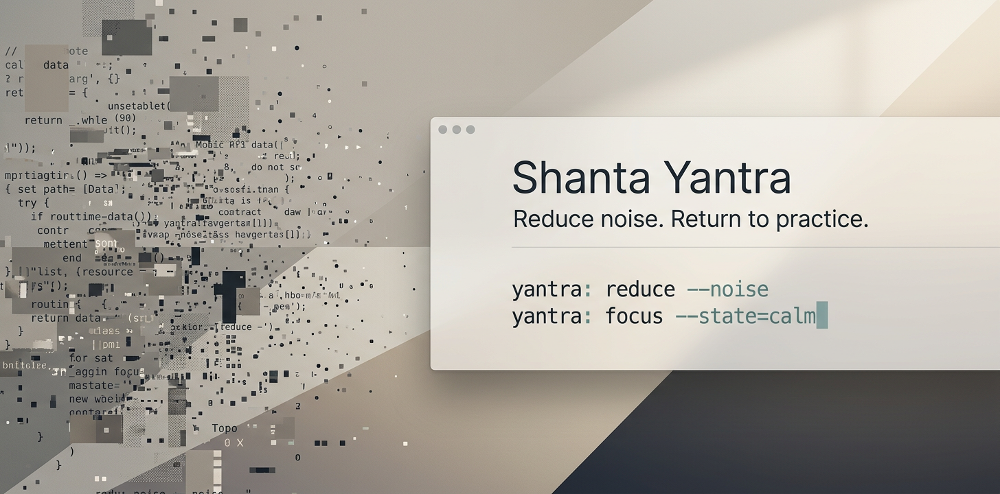

# Shanta Yantra

[](https://github.com/fayerman-source/shanta-yantra/actions/workflows/tests.yml)



Reduce noise. Return to practice.

Shanta Yantra is a bounded outer-observation tool designed to help people notice patterns in thought, speech, behavior, and attention without replacing direct practice.

The project is intentionally narrow. It treats AI as a tool for organizing outer and mental material, not as a guide, authority, or source of inner knowledge.

## Module Purpose

This repository is intentionally focused on one bounded public module:

- prove that useful reflective tooling can stay restrained
- make anti-dependence behavior concrete and testable
- return the user to offline practice instead of deepening machine reliance
- stop expansion if the module cannot remain both useful and bounded

## Why This Exists

Most AI systems are optimized to prolong attention. Shanta Yantra is designed to do the opposite.

Its purpose is to help users notice what is happening more clearly, reduce unnecessary mediation, and return to offline practice sooner.

It is also being shaped as an attention-protection tool: something that can notice drift, substitution, and screen capture without turning those patterns into more machine time.

## What Shanta Yantra Is

- A mirror for patterns in expression
- A support for clearer self-observation
- A framework for short, restrained interactions
- A guard against attention capture and lower-friction substitution
- A system that should reduce dependence on itself over time

## What Shanta Yantra Is Not

- A spiritual guide or teacher
- A measure of consciousness itself
- A source of revelation, transmission, or hidden authority
- A replacement for meditation, reflection, journaling, or focused work
- An engagement-optimized companion

## Core Principles

1. **Outer observation, not inner authority**
   Shanta Yantra may highlight patterns in expression, but it must not claim privileged access to a person's inner state.

2. **Notation, not proof**
   Any signal the system uses is notation only. It may help describe outer expression, but it is not proof of realization, progress, or truth.

3. **Short sessions, clear stopping points**
   The system should prefer one useful mirror and a return to practice over extended dialogue.

4. **No dependence loops**
   Shanta Yantra should avoid reward loops, anthropomorphic behavior, retention mechanics, and persuasive nudging.

5. **Restraint before ambition**
   The system should speak less as the work deepens, not more.

6. **Protect concentration**
   A valid feature should help users notice drift, interruption, and substitution before those patterns harden into dependence.

7. **Leave the inner station free**
   The system may organize outer and mental materials only. Inner discrimination remains with the person.

## Architecture Summary

Shanta Yantra is organized around one bounded public module:

- **v1.0: Outer Clarification**
  Text-first capture, short mirrors, one clarifying question at most, and explicit stopping behavior.
- **Later Work: Further Restraint**
  Any future expansion must become quieter, not more interpretive.
- **Deferred Research**
  Biometric, sleep, and environmental inputs are not part of the current implementation path for this repository.

## Design Standard

Every feature should make the system:

- more honest about what it can observe
- less likely to create dependence
- more willing to stop
- easier to leave behind when direct practice is available

## Current Status

This repository includes a runnable text-first v1.0 prototype with a deterministic Python CLI and test coverage.

Current contents:

- public positioning and boundaries
- public constitution for feature decisions
- architecture and interaction model
- roadmap for the next implementation steps
- deterministic Python CLI for bounded reflective output
- local JSON session logging
- tests for CLI behavior, response shaping, and session persistence
- early heuristics for decision-making, tradeoffs, and attention/substitution patterns

## What Exists Today

- one-shot CLI command: `shanta reflect`
- optional wrapper command: `shanta-wrap gemini`
- input via `--text`, `--transcript`, or stdin
- bounded response types: `mirror`, `question`, `practice_return`, `silence`, `safety_redirect`
- CLI ergonomics for inspection and review: `--version`, `--no-rationale`, `--output`
- deterministic heuristics layer with no model or API dependency
- local JSON session logs for inspection and debugging
- Gemini-first pre-send wrapper that can interrupt authority-seeking, permission loops, inner-state validation, and repeated AI drift patterns
- test suite covering core response paths and logging behavior

## Release Direction

The next step is not broader capability. It is a tighter adapter layer around the same bounded engine:

- strengthen wrapper eval coverage and false-positive control
- keep wrapper interruptions sparse, optional, and non-coercive
- add one integration at a time without turning Shanta into a persistent companion
- keep contributor expectations explicit around governance and boundary tests

## Install

```bash
uv sync --extra dev
```

## Quickstart

```bash
uv run shanta reflect --text "I should do this, but I keep avoiding it."
```

Example terminal output:

```text
type: mirror
This reads more like pressure meeting reluctance than a settled decision. Name the pressure, notice what tightens around it, and stop before turning it into a larger argument.

rationale: Conditioning and resistance are both present, so a direct mirror is more useful than a question.
signals: contradiction, conditioning, resistance
```

Transcript-file input:

```bash
uv run shanta reflect --transcript notes/session.txt
```

Gemini wrapper input:

```bash
uv run shanta-wrap gemini --prompt "I keep polling AIs until one gives me permission to make the move."
```

The wrapper is silent by default. When a clear threshold is crossed, it prints one bounded interruption before any further machine time.

Example JSON output:

```bash
uv run shanta reflect --text "I am overwhelmed and spinning over this again and again." --json
```

Representative JSON shape:

```json
{
  "response": {
    "type": "mirror",
    "text": "This looks like a real tradeoff, not a hidden perfect answer. Separate the possible value from the cost or constraint, set a clean rule, and then take one next step."
  },
  "observation": {
    "signals": ["contradiction", "hedge", "decision_question", "tradeoff"]
  }
}
```

Run the test suite:

```bash
uv run pytest -q
```

Inspect the current eval corpus:

```bash
uv run shanta eval-summary
```

Boundary-focused evaluation docs:

- `docs/EVALUATION.md`
- `docs/RAG_REVIEW_PROMPTS.md`

Canonical example sessions:

- `examples/README.md`

## v1.0 Limits

The current implementation is deliberately narrow:

- text or transcript-file input
- optional Gemini-first wrapper around one-shot prompt submission
- one-shot CLI interactions
- deterministic rules-first engine
- no live voice, no model dependency, no database
- bounded outputs plus explicit stopping behavior
- local-only session logging
- no inner-state assessment
- no biometric, sleep, or environmental inference

## Reading Order

1. `README.md`
2. `GOVERNANCE.md`
3. `docs/CONSTITUTION.md`
4. `docs/ARCHITECTURE.md`
5. `docs/INTERACTION_MODEL.md`
6. `docs/ROADMAP.md`
7. `docs/EVALUATION.md`
8. `docs/RAG_REVIEW_PROMPTS.md`
9. `docs/THESIS.md`
10. `docs/WHY_NOT_JUST_A_PROMPT.md`
11. `examples/README.md`

## Repository Structure

```text
shanta-yantra/
├── README.md
├── GOVERNANCE.md
├── CONTRIBUTING.md
├── SECURITY.md
├── LICENSE
├── docs/
│   ├── ARCHITECTURE.md
│   ├── CONSTITUTION.md
│   ├── EVALUATION.md
│   ├── INTERACTION_MODEL.md
│   ├── RAG_REVIEW_PROMPTS.md
│   ├── ROADMAP.md
│   ├── THESIS.md
│   └── WHY_NOT_JUST_A_PROMPT.md
├── src/shanta_yantra/
│   ├── cli.py
│   ├── engine.py
│   ├── heuristics.py
│   ├── models.py
│   └── session_store.py
├── examples/
│   ├── README.md
│   ├── reflect-authority.txt
│   ├── reflect-basic.txt
│   ├── reflect-inner-state.txt
│   └── reflect-tradeoff.json
└── tests/
    ├── test_cli.py
    ├── test_evals.py
    ├── test_engine.py
    └── test_session_store.py
```

## Contributing

See `CONTRIBUTING.md` for local development steps and contribution boundaries.

## Changelog

See `CHANGELOG.md` for release-oriented project history.

## Security

See `SECURITY.md` for vulnerability reporting guidance.

## License

MIT. See `LICENSE`.
